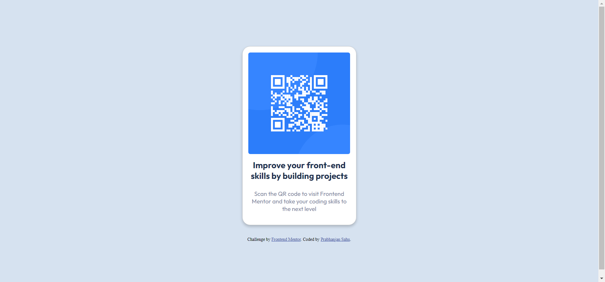

# Frontend Mentor - QR code component solution

This is a solution to the [QR code component challenge on Frontend Mentor](https://www.frontendmentor.io/challenges/qr-code-component-iux_sIO_H). Frontend Mentor challenges help you improve your coding skills by building realistic projects.

## Table of contents

- [Overview](#overview)
  - [Screenshot](#screenshot)
  - [Links](#links)
- [My process](#my-process)
  - [Built with](#built-with)
  - [What I learned](#what-i-learned)
  - [Continued development](#continued-development)
  - [Useful resources](#useful-resources)
- [Author](#author)
- [Acknowledgments](#acknowledgments)

## Overview

### Screenshot

### Links

- Solution URL: [Add solution URL here](https://your-solution-url.com)
- Live Site URL: [Add live site URL here](https://your-live-site-url.com)

## My process

### Built with

- Semantic HTML5 markup
- CSS custom properties
- Flexbox
- Mobile-first workflow

### What I learned

In this project, I learned how to build a QR code component and apply various front-end techniques. Here are some key takeaways:

- I improved my understanding of semantic HTML and how to structure a web page for better accessibility.
- CSS custom properties allowed me to create a consistent design and easily update styles.
- Flexbox helped me achieve responsive layouts for different screen sizes.
- I practiced a mobile-first workflow, ensuring the site looks and functions well on smaller screens.

### Continued development

While working on this project, I identified areas for further improvement and development, including:

- Custom Styling: I intend to customize and fine-tune the styles applied to the card. This includes adjusting colors, fonts, and spacing to better match the overall design of the project.
- Reducing Reliance on Bootstrap: While Bootstrap is a powerful tool, I aim to reduce reliance on its classes and potentially create custom styles where needed. This will help streamline the project and reduce unnecessary CSS code.
- Optimizing Asset Loading: To improve page load times and performance, I'll explore ways to optimize asset loading, including potentially hosting Bootstrap locally or selectively including only the Bootstrap components I need.

### Useful resources

During this challenge, I found the following resources helpful:

- **[Bootstrap](https://getbootstrap.com/docs/5.3/components/card)** - I drew inspiration from Bootstrap's card component and used its classes as a starting point for creating the card in this project.

- **[CSS Tricks - Flexbox Guide ](https://css-tricks.com/snippets/css/a-guide-to-flexbox/#aa-flexbox-properties)** - I referred to this guide to better understand and implement Flexbox for responsive layout design in the project.

## Author

- Frontend Mentor - [@WebPioneerPro](https://www.frontendmentor.io/profile/WebPioneerPro)
- **Web Development Course** - I honed my web development skills by completing [The Complete 2023 Web Development Bootcamp](https://www.udemy.com/course/the-complete-web-development-bootcamp), which provided me with a strong foundation in HTML, CSS, and JavaScript.

